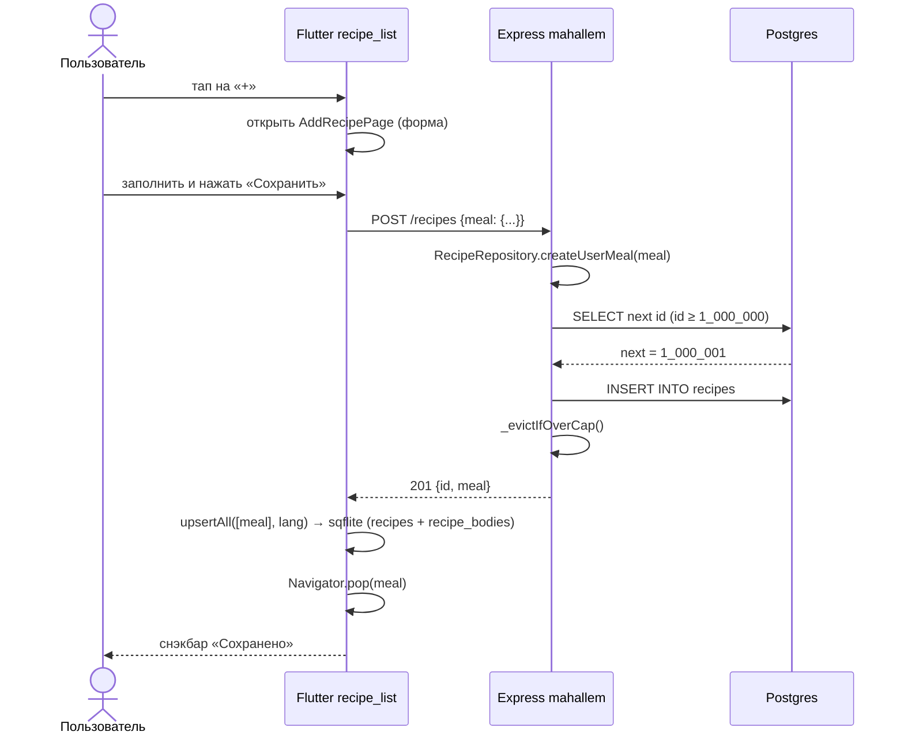

# Фича «Добавить рецепт»

> Документ для преподавателя Flutter-школы (Otus). Цель — показать,
> как именно реализована пользовательская история «нажал плюс →
> заполнил форму → рецепт сохранился и в локальной БД, и на сервере,
> и виден остальным пользователям» в учебном проекте `recipe_list`.
>
> Сопроводительные документы:
>
> - [`themealdb-add-recipe-investigation.md`](./themealdb-add-recipe-investigation.md)
>   — разбор того, **почему** добавленный пользователем
>   рецепт живёт только в нашей Postgres + локальном
>   sqflite, а не уходит в «родной» TheMealDB.
> - [`recipe-photo-upload.md`](./recipe-photo-upload.md) +
>   [`todo/recipe_photo_upload.md`](./todo/recipe_photo_upload.md)
>   — фаза «загрузка фото файлом» (image_picker → multipart
>   `POST /recipes` → storage-api → imgproxy). Реализована
>   и встроена в форму (см. §3.2); URL-вариант остался только
>   как web-fallback.

---

## 1. Краткая суть

Раньше клиент `recipe_list` мог только **читать** рецепты — сначала
напрямую из TheMealDB, потом через наш прокси-сервер
`mahallem_ist/local_user_portal` с переводами на лету. Теперь
добавлен путь **записи**: на главном экране со списком рецептов
появилась круглая FAB-кнопка с плюсом (зеркальная по отношению к
ранее сделанной FAB-кнопке «вверх»), которая открывает форму. После
сохранения рецепт:

1. отправляется POST-ом на наш сервер,
2. получает там стабильный `id` из «пользовательского» диапазона,
3. зеркалится в локальный sqflite, чтобы выжить cold-start,
4. возвращается в `RecipeListPage` и сразу появляется в начале
   ленты.

Пользователь видит результат немедленно; перевод на остальные локали
подтянется лениво — тем же конвейером, что переводит и реальные
TheMealDB-рецепты.

## 2. Архитектурная картинка

Поток данных от тапа на «+» до снэкбара «Сохранено» (VS Code
рендерит Mermaid-диаграммы во встроенном Markdown Preview):



Если Mermaid в твоём Markdown Preview не включён, та же
последовательность словами:

1. Пользователь тапает FAB `+` → открывается `AddRecipePage`.
2. Заполняет форму, тапает «Сохранить».
3. Клиент шлёт `POST /recipes {meal: {...}}` на mahallem.
4. Сервер вызывает `RecipeRepository.createUserMeal(meal)`,
   выбирает следующий `id` из пользовательского диапазона
   (`id ≥ 1_000_000`), делает `INSERT` и при необходимости
   `_evictIfOverCap`.
5. Возвращает `201 {id, meal}`.
6. Клиент зеркалит рецепт в sqflite (`recipes` + `recipe_bodies`)
   и закрывает форму через `Navigator.pop(meal)`.
7. На главном экране показывается снэкбар «Сохранено», рецепт
   встаёт в начало ленты.

Ленивый перевод (через `_ensureLang`) происходит **позже**, на
первом же `/recipes/lookup/:id?lang=ru` — это уже существующий
конвейер, ничего нового он не требует.

## 3. UI — FAB и форма

### 3.1. Кнопка `+`

Файл: [`recipe_list/lib/ui/recipe_list_page.dart`](../recipe_list/lib/ui/recipe_list_page.dart).

Кнопка живёт в том же `Stack`, что и FAB «вверх», только зеркально
прижата к левому нижнему углу:

```dart
Positioned(
  left: AppSpacing.lg,                  // тот же отступ, что у FAB-«вверх»
  bottom: AppSpacing.lg,
  child: _AddRecipeFab(
    onPressed: () => _openAddRecipe(context),
  ),
),
```

Визуально — точная копия FAB-а «вверх», по дизайн-системе
([`docs/design_system.md`](./design_system.md) §9b/§9n):

* круг 56×56,
* фон `AppColors.primary` с прозрачностью 0.85 (под FAB-ом видно
  ленту — кнопка не давит на контент),
* тень `AppShadows.navBar`,
* белая иконка `Icons.add`.

В отличие от FAB-«вверх», эта кнопка **видна всегда** —
пользователь должен иметь возможность добавить рецепт независимо
от позиции скролла.

A11y: новый ключ `a11y.addRecipe` (10 локалей, slang перегенерирован).
Tooltip + `Semantics(button: true, label: …)`.

### 3.2. Форма

Файл: [`recipe_list/lib/ui/add_recipe_page.dart`](../recipe_list/lib/ui/add_recipe_page.dart).

`StatefulWidget` с `Form` + `GlobalKey<FormState>` + классическим
набором `TextEditingController`-ов. Поля:

| Поле | Обязательное | Куда мапится |
|---|---|---|
| Название | ✓ | `strMeal` |
| Фотография | ✓ | `strMealThumb` — пикер с камеры/галереи (160×160 dp превью + bottom-sheet); URL-ввод остаётся только в web-fallback. Реализация — в [`recipe-photo-upload.md`](./recipe-photo-upload.md) + [`todo/recipe_photo_upload.md`](./todo/recipe_photo_upload.md). |
| Категория | – | `strCategory` |
| Кухня | – | `strArea` |
| Инструкция | – | `strInstructions`, multi-line |
| Ингредиенты | – | textarea, формат `название \| мера` (по одному на строку), парсится в `strIngredient1..20` / `strMeasure1..20` |

Сверху формы — текст-подсказка `addRecipeEnglishHint`:
«Заполняйте по-английски, переводы создадутся автоматически».
Это важно: серверный `_ensureLang` ожидает английский в
`i18n.en` и оттуда уже переводит на ru/es/fr/etc.
(см. `mahallem_ist/local_user_portal/docs/translation-pipeline.md`).

Состояние `_saving` блокирует форму через `AbsorbPointer` и
переключает текст кнопки на `addRecipeSaving` («Сохраняем…»).

При отправке форма строит `Recipe`-объект (со «временным» `id: 0`,
он будет заменён сервером) и вызывает `RecipeApi.createRecipe`.

## 4. Клиент — `RecipeApi.createRecipe`

Файл: [`recipe_list/lib/data/api/recipe_api.dart`](../recipe_list/lib/data/api/recipe_api.dart).

```dart
Future<Recipe> createRecipe(Recipe draft) async {
  if (_client.backend != RecipeBackend.mahallem) {
    throw StateError('createRecipe requires the mahallem backend');
  }
  final meal = <String, dynamic>{
    'strMeal': draft.name,
    'strMealThumb': draft.photo,
    if (draft.category != null) 'strCategory': draft.category,
    if (draft.area != null) 'strArea': draft.area,
    if (draft.instructions != null) 'strInstructions': draft.instructions,
    for (var i = 0; i < draft.ingredients.length && i < 20; i++) ...{
      'strIngredient${i + 1}': draft.ingredients[i].name,
      'strMeasure${i + 1}': draft.ingredients[i].measure,
    },
  };
  final res = await _client.dio.post<Map<String, dynamic>>(
    '',                                  // dio.baseUrl == https://mahallem.ist/recipes
    data: {'meal': meal},
  );
  return Recipe.fromMealDb(res.data!['meal']);
}
```

**Что важно показать студентам:**

* Метод намеренно проваливает запрос, если активен бэкенд TheMealDB
  (`RecipeApiConfig.backend != mahallem`). Это явный отказ — у
  публичного TheMealDB нет POST-а (см. сопроводительный документ).
* Тело запроса сериализуется в TheMealDB-shape (49 полей с
  `strIngredient1..20` / `strMeasure1..20`) — точно та же форма, в
  которой клиент уже умеет читать ответы. Один парсер
  `Recipe.fromMealDb` обслуживает оба направления.
* Бэкенд `mahallem` уже включает `/recipes` в `dio.baseUrl`, поэтому
  путь у POST-а — пустая строка.

После ответа клиент:

```dart
final saved = await api.createRecipe(draft);
try {
  await widget.repository?.upsertAll([saved], appLang.value);
} catch (_) { /* sqflite-сбой не откатывает серверную запись */ }
Navigator.of(context).pop(saved);
```

Список на предыдущем экране подхватывает `saved` через
`_openAddRecipe` и кладёт его в начало `_displayed` без полной
перезагрузки ленты.

## 5. Сервер — `POST /recipes`

Файл: `mahallem_ist/local_user_portal/routes/recipes.js`
(репозиторий `mahallem_ist`).

Контракт:

```http
POST /recipes
Content-Type: application/json
x-recipes-token: <RECIPES_API_SECRET>     # только если RECIPES_API_SECRET выставлен

{
  "meal": {
    "strMeal":         "Бабушкин пирог",
    "strMealThumb":    "https://example.com/pie.jpg",
    "strCategory":     "Dessert",
    "strArea":         "Russian",
    "strInstructions": "Замесить тесто, …",
    "strIngredient1":  "Flour",   "strMeasure1": "500 g",
    "strIngredient2":  "Apples",  "strMeasure2": "4 pcs"
  }
}
```

Возможные ответы:

| Код | Тело | Когда |
|---|---|---|
| 201 | `{id, meal: {idMeal, strMeal, …}}` | Успех. `id` — новый, из пользовательского диапазона. |
| 400 | `{error: "missing_meal"}` | Тело без поля `meal`. |
| 400 | `{error: "missing_required_fields"}` | Нет `strMeal` или `strMealThumb`. |
| 400 | `{error: "invalid_meal"}` | `canonicalize` отверг payload. |
| 401 | `{error: "unauthorized"}` | Включена авторизация и токен не подошёл. |
| 500 | `{error: "internal"}` | SQL/неожиданное. |

### 5.1. Где ручка крепится

```js
app.use('/recipes', limiter, authMiddleware);
…
app.post('/recipes', async (req, res) => { … });
```

То есть POST автоматически попадает под:

* **rate limit** 1200 запросов/мин/IP (`express-rate-limit`),
* **shared-secret middleware** — если `RECIPES_API_SECRET` задан в
  `.env` сервера, клиент обязан слать заголовок `x-recipes-token`.
  Если переменной нет (как в текущем проде) — гейтинг отключён, и
  любой может постить. Это сознательный компромисс ради простоты
  учебного MVP.

### 5.2. Метод репозитория

```js
async createUserMeal(meal) {
  const draft = canonicalize(meal);
  if (!draft || !draft.strMeal || !draft.strMealThumb) {
    throw new Error('invalid_meal');
  }
  const floor = Number(process.env.RECIPES_USER_MEAL_ID_FLOOR || 1_000_000);
  const rows = await this.q(
    `SELECT COALESCE(MAX(id), $1::bigint - 1) + 1 AS next
       FROM recipes WHERE id >= $1`,
    [floor],
  );
  const id = Number(rows[0].next);
  draft.idMeal = String(id);
  const i18n = JSON.stringify({ [SOURCE_LANG]: draft });
  const hash = contentHash(draft);
  await this.q(
    `INSERT INTO recipes (id, i18n, category, area, content_hash, popularity, fetched_at)
     VALUES ($1, $2::jsonb, $3, $4, $5, 0, NOW())`,
    [id, i18n, draft.strCategory, draft.strArea, hash],
  );
  await this._evictIfOverCap();
  return { id, meal: draft };
}
```

Ключевая деталь — диапазон id. У TheMealDB рецепты — пятизначные
числа (52000–53000). Мы выделяем для пользовательских рецептов
**отдельную полуось**: `id ≥ RECIPES_USER_MEAL_ID_FLOOR` (по
умолчанию `1_000_000`). Так гарантируется, что:

* любая ревизия загрузки upstream-каталога (через `upsertEnglish`)
  никогда не наступит на пользовательский рецепт,
* eviction-политика (LRU по `popularity asc, fetched_at asc`) видит
  пользовательские записи как обычные строки таблицы и при перепол-
  нении честно их вытесняет, как и старые TheMealDB-рецепты.

### 5.3. Что происходит дальше

Ничего магического: рецепт просто лежит в `recipes` под
`i18n.en = <тот же canonical-объект>`. Когда какой-то клиент позже
запросит `/recipes/lookup/:id?lang=ru`, штатный `_ensureLang`
увидит, что `i18n.ru` отсутствует, дёрнет `translateRecipe(en, en, ru)`
(Gemini), пройдёт echo-gate (см. `translation-pipeline.md`) и
запишет результат обратно в `i18n`. После этого все последующие
чтения на `ru` идут из БД без обращения к Gemini.

## 6. Локальный кэш (sqflite)

Сервер вернул `Recipe` с присвоенным id — мы кладём его в
`RecipeRepository.upsertAll([saved], lang)`. Этот метод (todo/12,
todo/13) уже умеет:

* писать в `recipes` и в sibling-таблицу `recipe_bodies` (тяжёлые
  поля типа `instructions` живут там, а не в основном узком ряду),
* применять 60/40 LRU-сплит между активной локалью и остальными
  (todo/13).

Ошибка sqflite **не откатывает серверную запись** — сервер уже
коммитнул, рецепт всё равно догрузится при следующем
`/recipes/page`. Это сознательный выбор: лучше иметь рецепт «там»
без локального кэша, чем потерять его совсем из-за нестабильного
диска на устройстве.

## 7. i18n

Добавлен один новый ключ `a11y.addRecipe` и 13 ключей формы
(`addRecipeTitle`, `addRecipeName`, `addRecipePhoto`,
`addRecipeCategory`, `addRecipeArea`, `addRecipeInstructions`,
`addRecipeIngredientsLabel`, `addRecipeSubmit`, `addRecipeRequired`,
`addRecipeEnglishHint`, `addRecipeSaving`, `addRecipeError`,
`addRecipeSuccess`) во все 10 локалей (en, ru, es, fr, de, it, tr,
ar, fa, ku). После правки JSON прогоняется `dart run slang`, чтобы
сгенерировать `lib/i18n/strings*.g.dart`. Геттеры в `lib/i18n.dart`
дополнены вручную — там, где через слой `S.of(context)` ходит весь
UI.

## 8. Тесты

**Сервер.** Два новых сценария в
`local_user_portal/tests/recipes.test.js`:

1. `createUserMeal` — сначала пишем существующий TheMealDB-id
   (53000), потом вызываем `createUserMeal` и проверяем, что
   первый присвоенный id равен **ровно** `1_000_000` (диапазон
   изолирован), а второй — `1_000_001`.
2. Без `strMeal` или без `strMealThumb` метод должен бросать
   `invalid_meal`.

Прогон: `node --test tests/recipes.test.js` → **12 пройдено** /
2 упали (это унаследованный baseline из echo-gate cases, не
связанный с фичей; этим занимается отдельный тикет).

**Клиент.** Самой формы тест нет — UI-тесты на форму не входили в
объём задачи. `flutter analyze` чистый. `flutter test --no-pub`
держит baseline 56 / 2 (те же два упавших, что и до фичи).

## 9. Что осознанно вынесено за рамки

| Что | Почему |
|---|---|
| Редактирование/удаление рецепта | `POST /recipes` всегда выделяет новый id. `PUT` и `DELETE` пока не нужны. |
| Несколько фото на рецепт | Требует отдельной таблицы `recipe_photos`; bucket и пикер сейчас рассчитаны на одну титульную. |
| Публикация в TheMealDB upstream | Нет публичного POST-а, см. [`themealdb-add-recipe-investigation.md`](./themealdb-add-recipe-investigation.md). |
| Премодерация | Учебный проект — никакой queue нет. В реальном продукте надо ставить flag-колонку и админ-страницу. |

## 10. Чек-лист «пройти глазами в IDE»

| Слой | Файл | Что искать |
|---|---|---|
| UI | `recipe_list/lib/ui/recipe_list_page.dart` | `_AddRecipeFab`, `_openAddRecipe`, второй `Positioned(left: …)` |
| UI | `recipe_list/lib/ui/add_recipe_page.dart` | сама форма, `_PhotoPicker`, `_pickPhoto`, `_save` |
| API | `recipe_list/lib/data/api/recipe_api.dart` | `createRecipe`, `createRecipeWithPhoto`, `_mealToJson` |
| Photo | `recipe_list/lib/utils/photo_downscaler.dart` | `downscaleForUpload` (1600×1600 q80 JPEG, EXIF-strip) |
| Photo | `recipe_list/lib/utils/imgproxy.dart` | `imgproxyUrl(src, w, h)` — thumbnail через imgproxy |
| i18n | `recipe_list/lib/i18n/*.i18n.json` (10 шт.) | `a11y.addRecipe`, `a11y.addRecipePhotoPicker`, `addRecipe*`, `addRecipePhoto*` |
| i18n-фасад | `recipe_list/lib/i18n.dart` | геттеры `addRecipe*` и `addRecipePhoto*` |
| Сервер | `mahallem_ist/local_user_portal/routes/recipes.js` | `createUserMeal`, `updateUserMealThumb`, `recipePhotoUpload` (multer), `multipartLimiter`, `app.post('/recipes', …)` с multipart-веткой |
| Сервер | `mahallem_ist/local_user_portal/lib/jobs/cleanup-orphan-recipe-photos.js` | еженедельный sweep орфан-файлов |
| Сервер | `mahallem_ist/local_user_portal/utils/storage-upload.js` + `utils/backup-service.js` | ветка `recipe-photos` в `uploadToStorage` и `backupRecipePhotoFile` |
| Миграция | `mahallem_ist/local_docker_admin_backend/database/migrations/20260429_create_recipe_photos_bucket.sql` | bucket + 3 RLS политики |
| Compose | `mahallem_ist/local_docker_admin_backend/docker-compose.yml` | маунт `09.76-recipe-photos-bucket.sql` |
| Тесты | `mahallem_ist/local_user_portal/tests/recipes.test.js` | `createUserMeal …`, `updateUserMealThumb …`, multipart-роут (4 теста) |
| Тесты | `recipe_list/test/recipe_api_test.dart` | `createRecipeWithPhoto слепит multipart` |
| Документация | `otus_dz/docs/add-recipe-feature.md` | этот файл |
| Документация | `otus_dz/docs/themealdb-add-recipe-investigation.md` | почему не пишем в TheMealDB upstream |
| Документация | `otus_dz/docs/recipe-photo-upload.md` | дизайн фазы photo-upload |
| TODO | `otus_dz/docs/todo/recipe_photo_upload.md` | 15-чанковый план под фото-загрузку (1–14 сделаны) |
